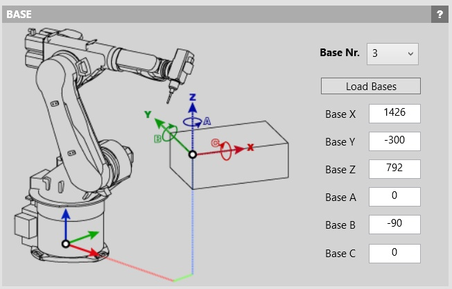
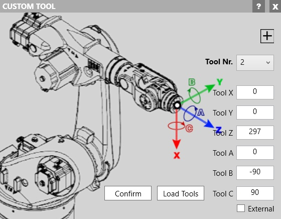
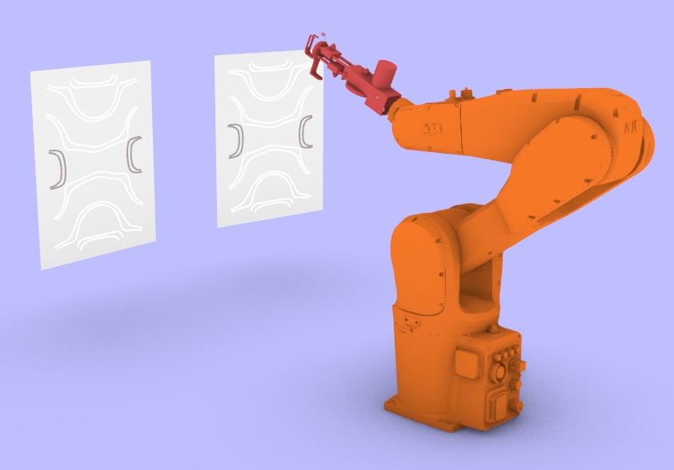
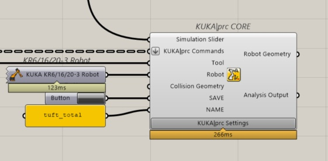
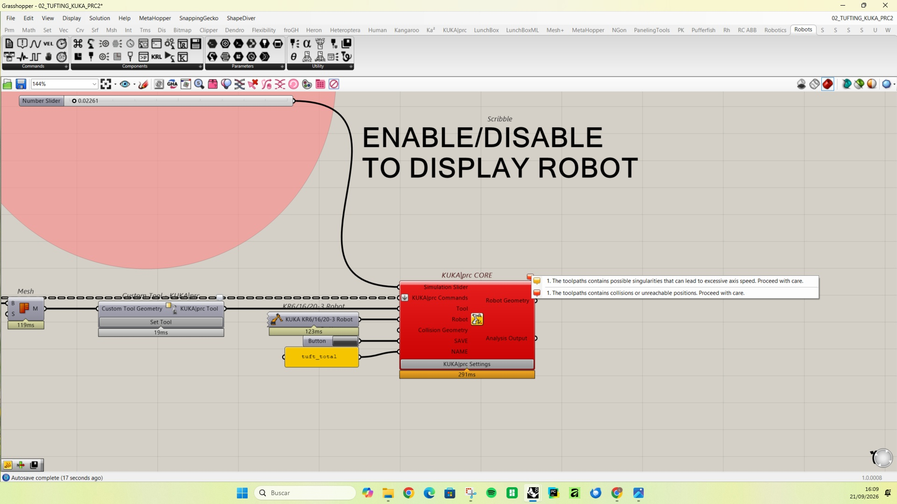

### The two set up

Set up at Lowpoly in Madrid (left), Set up at SUPSI Fablab in Mendrisio (right).

 

Both prototypes are based on the same image (JPEG format, to ensure the script works correctly).

 

The image undergoes vectorization using the Vectorize plugin, distinguishing between two zones: the one corresponding to the color white and the one corresponding to the color brown.

The lines are spaced at least 5 mm apart to prevent the canvas from tearing during the execution of the pattern.
Line segments shorter than 20 mm are omitted to avoid tearing the canvas.
The resulting curves form the toolpath that the robot will follow. In Mendrisio, this is carried out using a KUKA KR6/16/20-3 model, while in Madrid, an ABB IRB1200 model is used.
The image used at both locations measures 400 x 500 mm.
The positioning of the robot relative to the frame holding the canvas is as follows:

Mendrisio (KUKA KR6/16/20-3):

Madrid (ABB IRB1200):

An end effector with the tufting gun is attached to the flange of both robot models, with the TCP configured as follows:

Mendrisio (KUKA KR6/16/20-3):

Madrid (ABB IRB1200):

## Single frame and multi frame options - What to bare in mind

In single-frame mode, the frame holding the canvas is positioned facing the robot, within the effective working area.

In multi-frame mode, simulated in Madrid using the ABB IRB1200 robot, both canvases are placed facing the robot, one after another with a 22 cm separation, as shown in the image.

## Space minimum requirements

The frame and canvas must be positioned within the effective working area. 
Using the KUKA|prc CORE component within the script, we can visually verify whether the position is reachable throughout the entire toolpath.
If the component appears gray, the position is correct, and the robot can reach all positions.
If the component turns orange, the robot encounters a singularity while attempting to reach a position; therefore, it is advisable to readjust the position.
If the component turns red, the canvas position lies outside the effective working area and requires modification.

 

