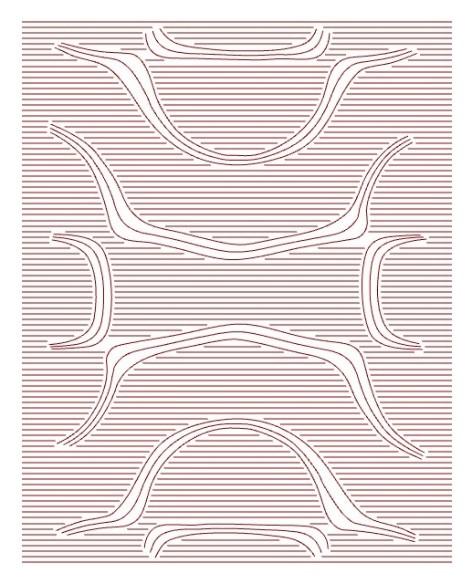

## Production Workflow 

1 - Image processing (JPEG format for correct script operation) using the Vectorize plugin, distinguishing between two zones: the one corresponding to the color white and the one corresponding to the color brown.

  

2 - In the brown-colored area, a pattern of parallel lines is established with a minimum spacing of 5 mm to prevent the canvas from tearing. Where they intersect with white-colored areas, the lines are interrupted and resume on the other side of the area. Line segments shorter than 20 mm are omitted to avoid tearing the canvas.

3 - The white-colored areas are woven by interpolating the outer lines, such that three curves are woven for each of the shapes.

4 - The obtained curves are arranged into two blocks (white/brown), and the direction of the curves, which the robot will follow, is established.

5 - The file containing the curve geometry is divided into two main blocks. 

6 - The robot's initial position is established, and a first point, serving as a calibration reference, is included to coincide with one of the frame's corners. This allows the frame's position to be verified at the start of program execution to determine whether it is correct or requires readjustment.

7 - The robot begins tufting the white lines. Digital output pins are used to activate and deactivate the tufting gun, as well as to light up a green indicator lamp showing that the robot is in operation.

8 - When the first block is finished, the robot deactivates the green DO, activates the red DO, and moves to a configured rest position to proceed with the thread color change.

9 - Once the wire has been changed, a push-button must be used, configuring a digital input (DI), for the robot to restart the robot´s movement.

10 - The robot begins tufting the brown lines. Digital output (DO) pins are used to activate and deactivate the tufting gun, as well as to light up a green indicator showing that the robot is in operation. Once finished, the robot returns to its starting position..

### Troubleshooting and commons errors

The script correctly reads the image when it is in JPEG format. Complex images can be difficult for the Vectorize plugin to process.

