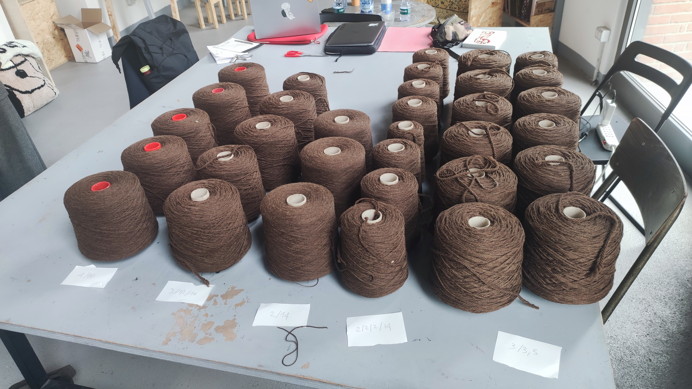
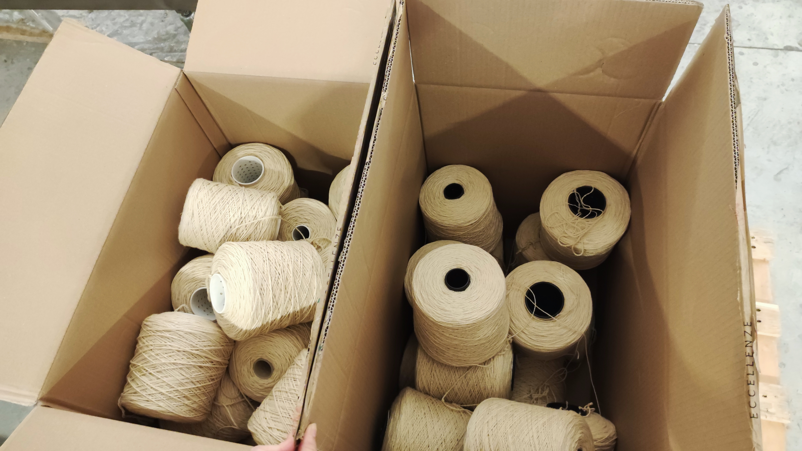

## Native coarse wool
### Yarn specifications
During the project we worked with wool sourced from [Associazione pecora brogna della lessinia](https://www.pecorabrogna.it/) and we produced the following yarns titles:  2/3500 - 3/3500 - 2/2/2/14000 -  3/2/2/14000.

First batch of yarns produced with naturally brown wool.
These yarns were hand-tuft and robo-tuft to test them and became instrumental to definition of the final yarns.

Second batch of yarns produced with naturally white wool from Pecora Brogna.

