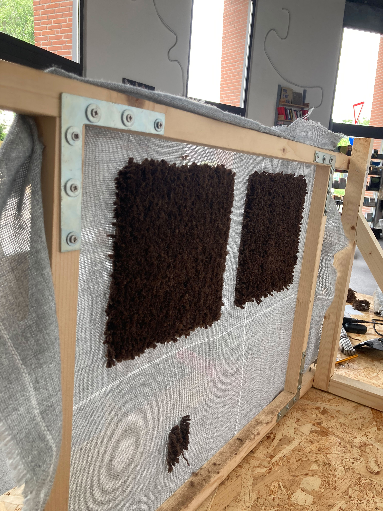
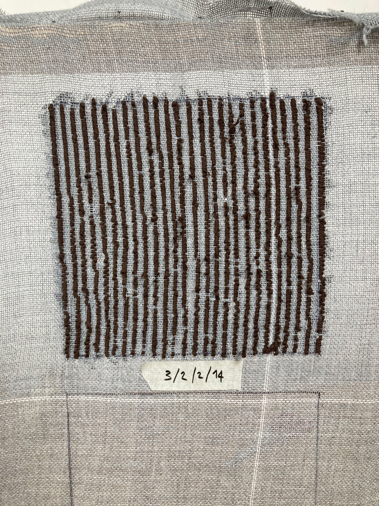
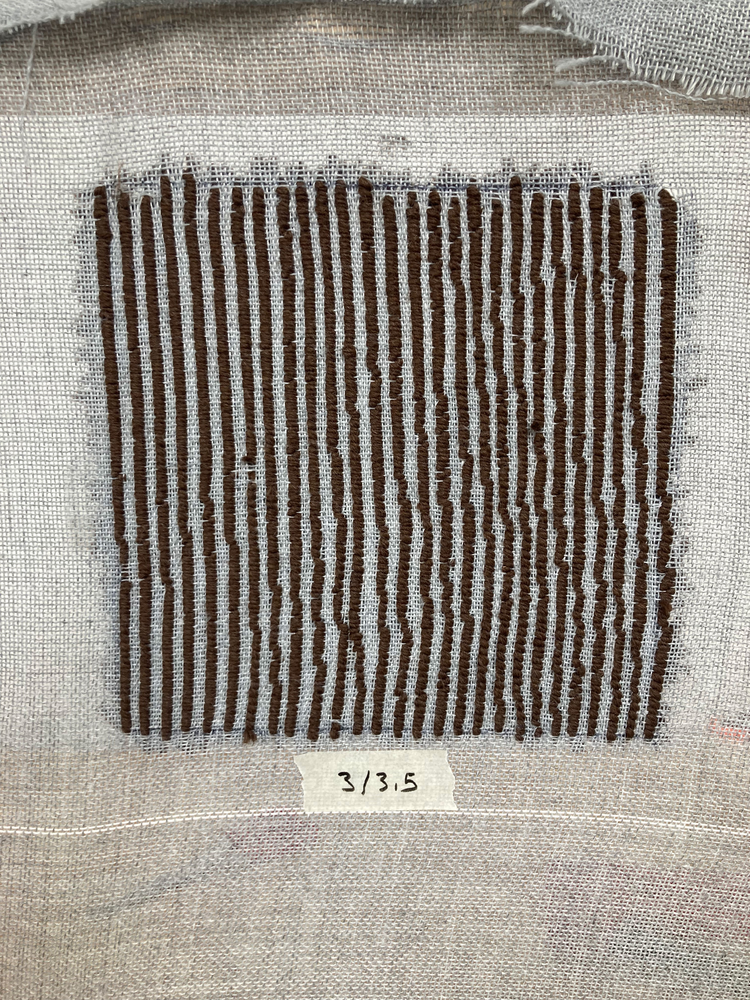
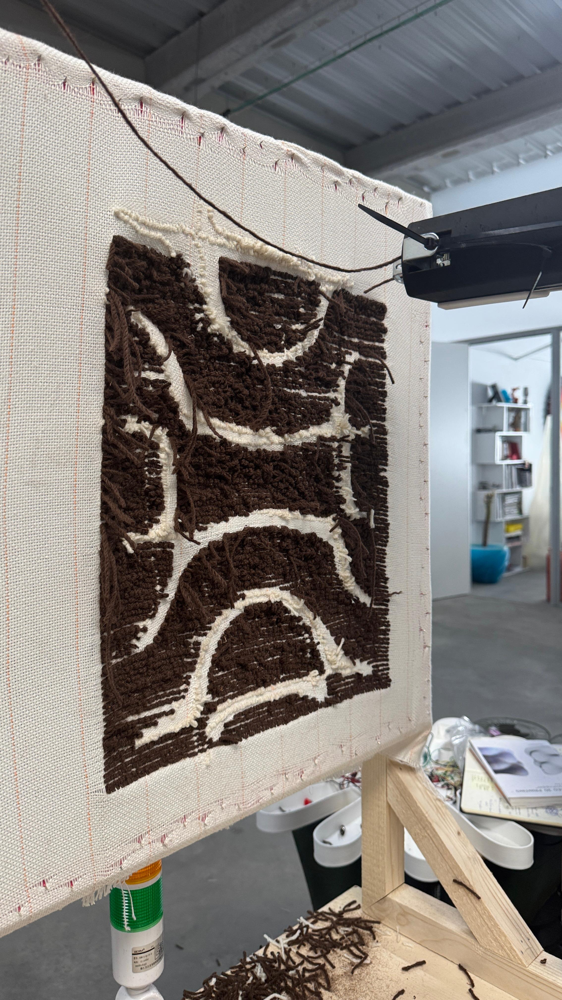
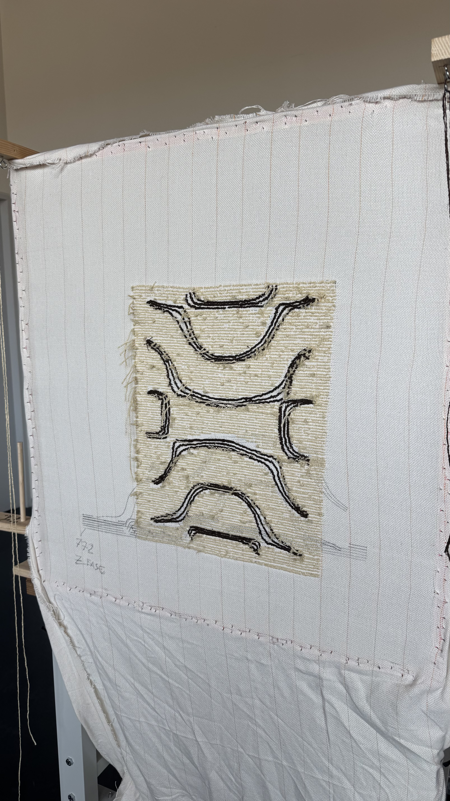
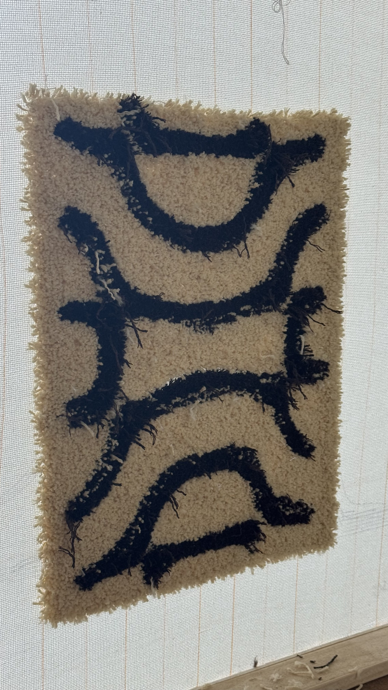
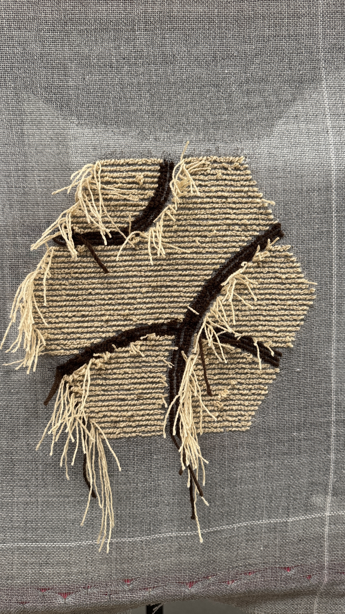
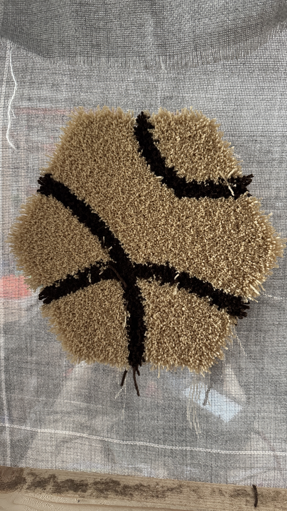

## Tests and iterations

The project was made through a series of tests and iterations, moving from hand tufting samples to robotic tufting and back.
Here you can find a series of images of the different tests developed between Milan, Madrid and Mendrisio.

Hand tufted test of the first batch of yarns produced. 
With these samples we were trying to understand optimal tuftig speed and distance between the lines.
These information were used in setting the robo-tuft.

  

After the production of plain samples to do basic set up of the Tuftbot we moved toward tufring more complex geometries with two colours.
We used a drawing developed by Eva Failla di [Studio Converter](https://studioconverter.com/) in both set up, Madrid and Mendrisio.
This step was fundamental to test the software that generate the tufting path from an image and define the lines resolution.

  

Finally with the feedbacks gainend by printing Studio Converter Piece we produced a set of tiles which compose a modular tapestry. The tiles graphic has been produced using the developed tiles generator Hexweave.

  

