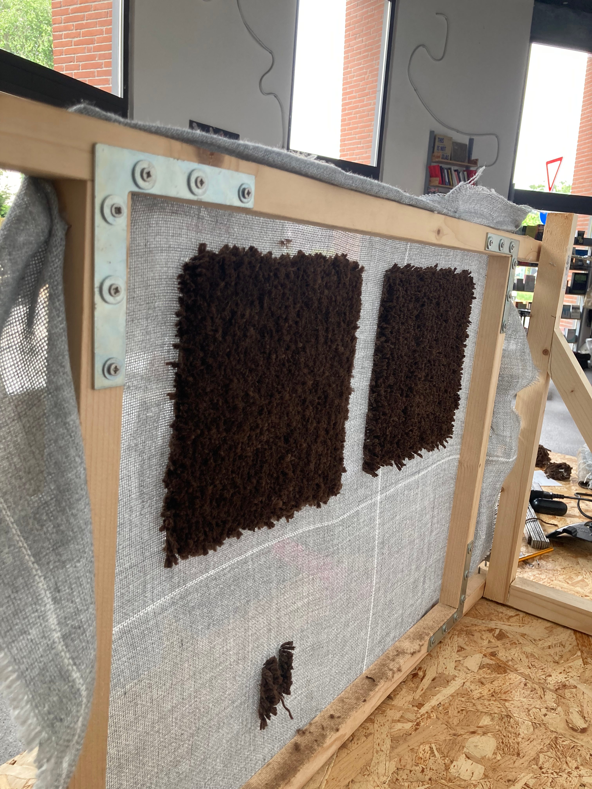
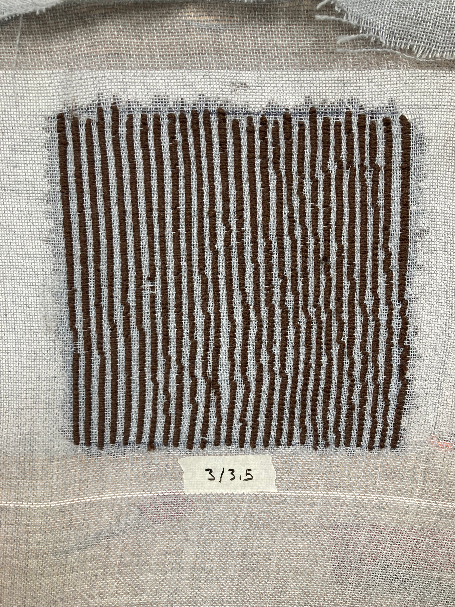

## Tests and iterations

The project was made through a series of tests and iterations, moving from hand tufting samples to robotic tufting and back.
Here you can find a series of images of the different tests developed between Milan, Madrid and Mendrisio.

 

