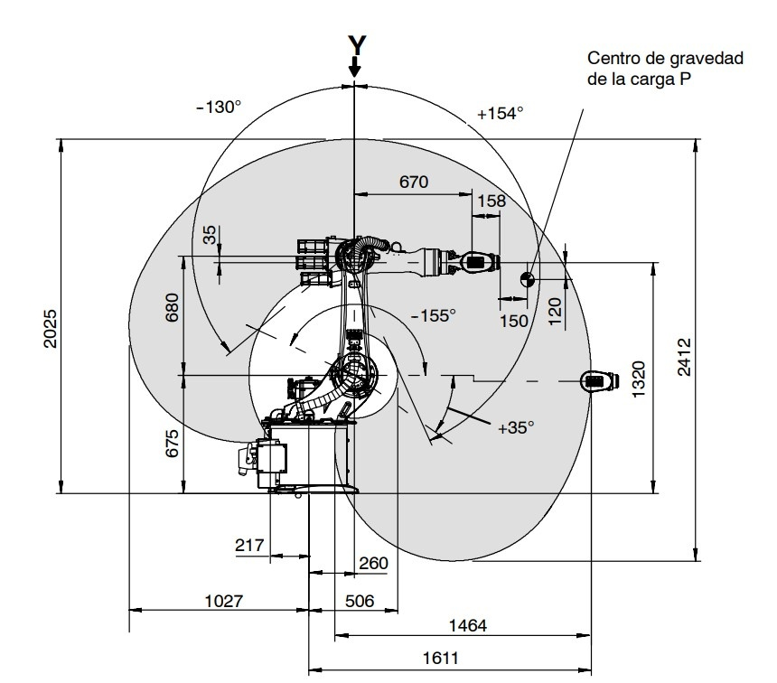
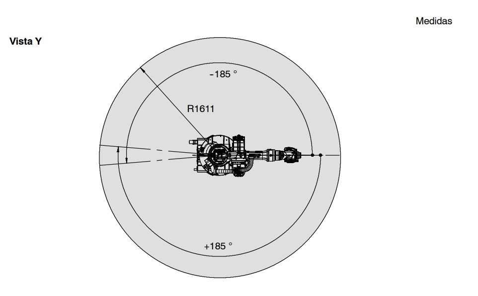
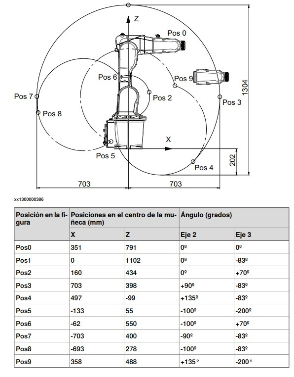
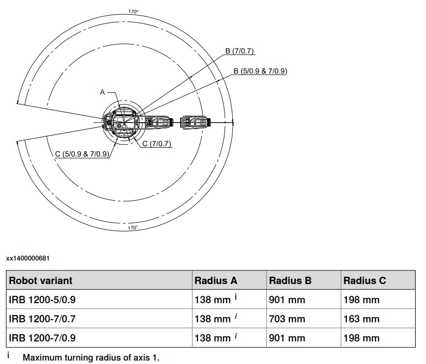
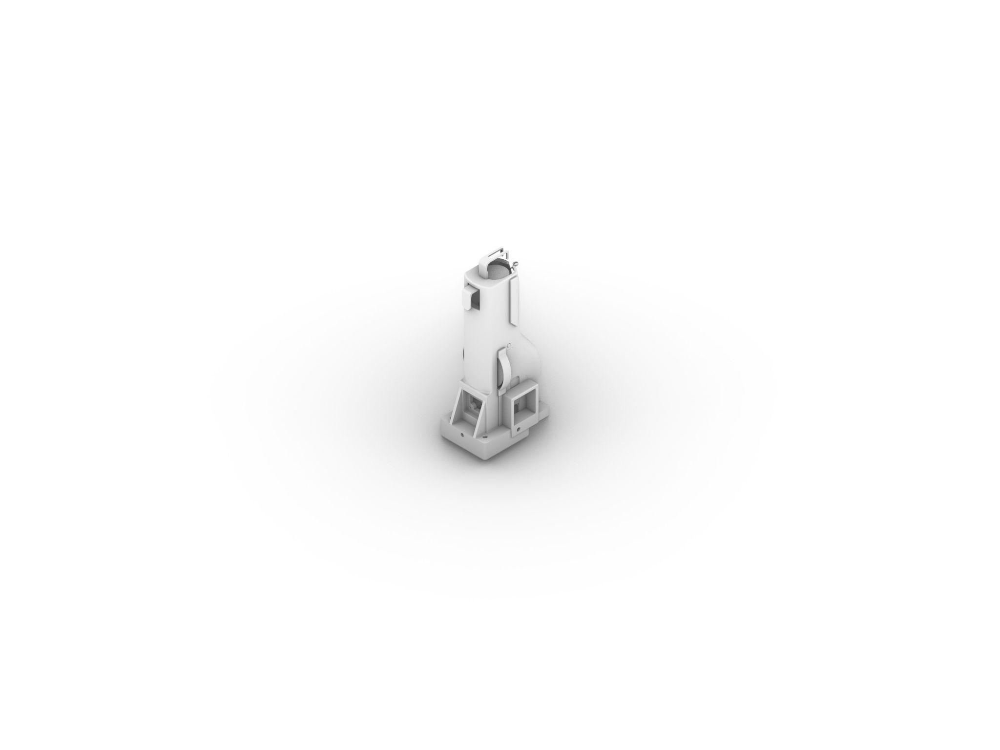
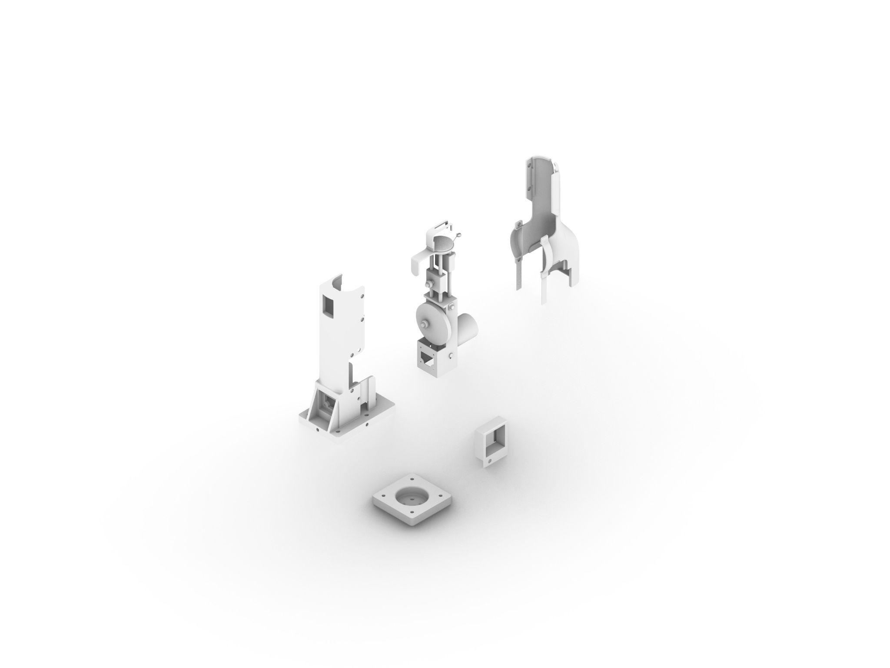
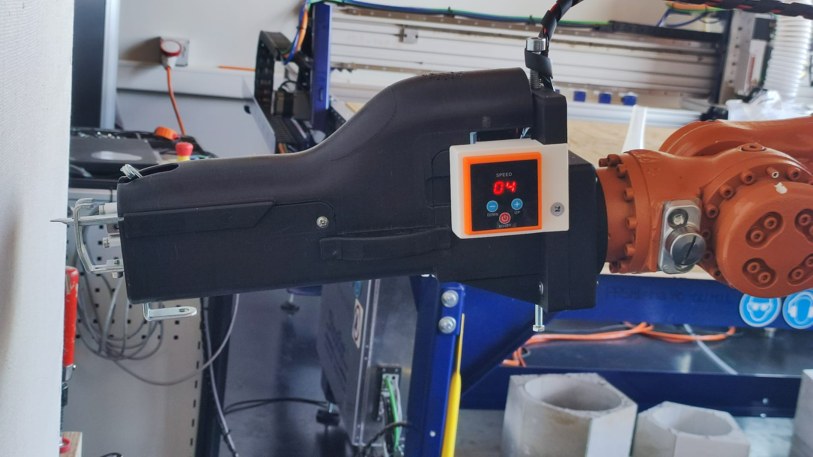

## Hardware

### Robot minimum specifications

The payload needs to be minimum 3,5/ 5 kg in order to carry a 1kg gun in order to resist the backfire while tufting. 

Maximum printing area calculation according to robot dimensions

Given a certain arm extension the printing area can be calculated as follow:

| Type of robotic arm tested | Measures arm | Measures max tufting area |
| ----------- | ----------- | ----------- |
| KUKA KR6/16/20-3 | 1611 x 1320 x 138 mm | 1464 x 2025 mm |
| ABB IRB1200 | 539 x 869 x 115 mm  | 703 x 1102 mm |

- KUKA KR6/16/20-3:
  
  

- ABB IRB1200:

    

### List of components 

### End effector 

The end effector is 3d printed. It is composed of two parts, one that gets attached to the robot and needs to be custom made for each robot, and one that is made for standard tufting guns. This second part has holes with a margin in order to adapt to the subtle differences of each gun. 

 

To see 3d files go to this [folder](Files/Hardware-Files)

Here you can see an image of the end effector printed and mounted on the KUKA at SUPSI.

### Tufting gun specifics

Currently this standard hand tufting gun has been tested: 
45mm Electroacupuncture Long Velvet Tufting Gun Cutting Loop Velvet Carpet Weaving Machine 4-25 Needle Steps Shuttle Loom Tool and the end effector has been designed accordingly.

At this  [link](https://it.aliexpress.com/item/1005010391053075.html?spm=a2g0o.order_list.order_list_main.16.6a7d194dq0kd71&gatewayAdapt=esp2ita) you can find the gun we worked with. 

 ### Sensors

We chose to test industrial sensors already used in textile machinery. There are two kinds of sensors, one to see if the yarn is present and one to detect if it’s moving. They are both fundamental to try to automatize the tufting process.

The robotic arm can turn the tufting gun on/off and read sensors that check if the yarn is running. Two sensors are used: a hall-effect sensor that detects rotation while yarn moves, and a vibration sensor that detects yarn motion; if either fails, the arm and gun stop so the operator can replace the yarn, then restart. However, the system can’t confirm that each stitch was actually inserted into the canvas, the gun’s own vibrations can trick the vibration sensor, and the hall-effect sensor can lose the yarn, making the whole stop–replace–restart flow unreliable.

The following sensors have been tested: [DC12-24V NPN PNP induction sensor Switch](https://it.aliexpress.com/item/1005002883343587.html?spm=a2g0o.order_list.order_list_main.59.1a50194d9428fY&gatewayAdapt=esp2ita) and [Twisting Yarn Sensor Wire Device ](https://it.aliexpress.com/item/4000093115538.html?spm=a2g0o.order_list.order_list_main.60.1a50194d9428fY&gatewayAdapt=esp2ita)

