## Software

### Links and plug in

KUKA|prc (KUKA KR6/16/20-3)

Vectorize (package manager Rhino and plugin for grasshopper)

Treesloth (package manager Rhino)

Robots (ABB IRB1200)

[Image processing](Files/Software-Files/01_Image_processing)

[Robot Tufting KUKA](Files/Software-Files/02_Robot_Tufting_KUKA)

[Robot Tufting ABB](Files/Software-Files/03_Robot_Tufting_ABB)

[Multiframe ABB Simulation](Files/Software-Files/04_Multiframe_ABB_Simulation)

### Grasshopper code for single frame 

Image processing (JPEG format for correct script operation) using the Vectorize plugin, distinguishing between two zones: the one corresponding to the color white and the one corresponding to the color brown.

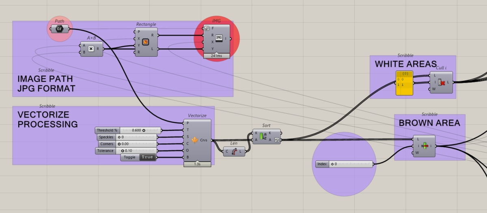

The white areas are calculated by interpolating the outer lines, such that three curves are knitted for each of the shapes.

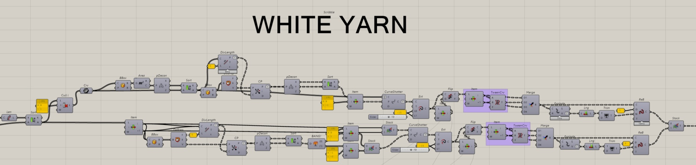

In the brown area, a pattern of parallel lines is established with a minimum spacing of 5 mm to prevent the canvas from tearing. Where they intersect with white areas, the lines are interrupted and resume at the end of that area. Line segments shorter than 20 mm are omitted to prevent the canvas from tearing.

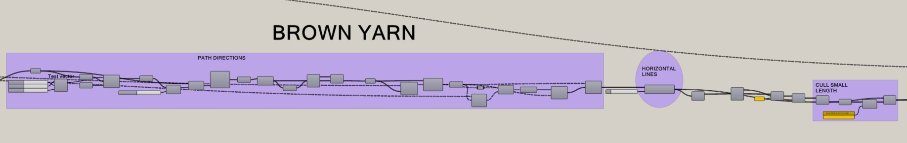

The obtained curves are organized into two blocks (white/brown), and the direction of the curves, which the robot will follow, is established.
The file containing the curve geometry is divided into two main blocks. 

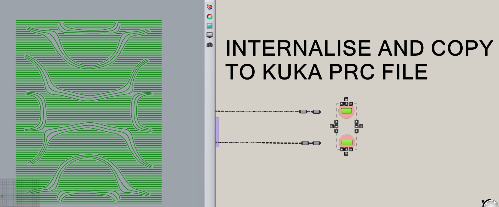

The two curve blocks are oriented and positioned. The curves are converted into polylines to adjust the robot's movement precision.

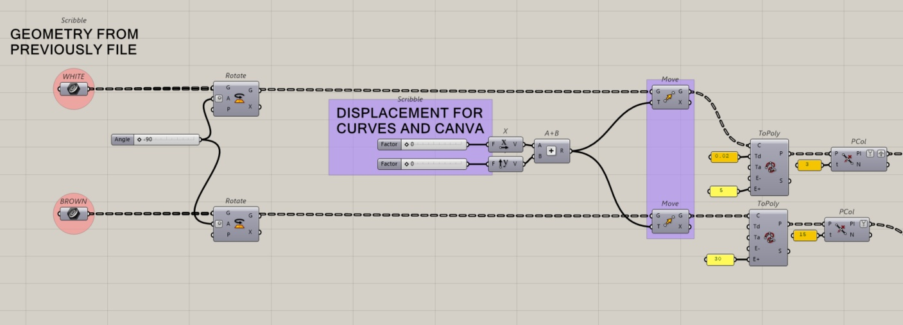

The initial and final positions of the robot are established.

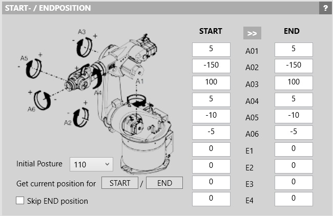

We include an initial calibration point that aligns with one of the frame's corners. This allows the frame's position to be verified, or readjusted if necessary, at the start of the program's execution.

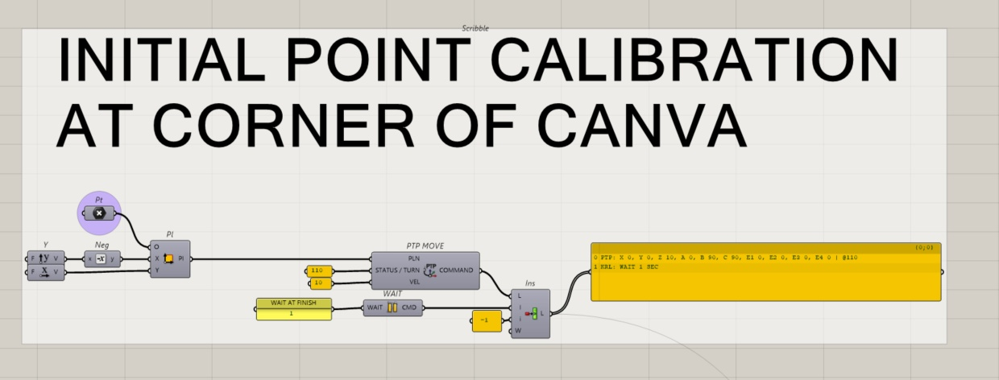

The robot begins tufting the white lines. Digital output pins are used to activate and deactivate the tufting gun, as well as to light up a green indicator lamp showing that the robot is in operation.

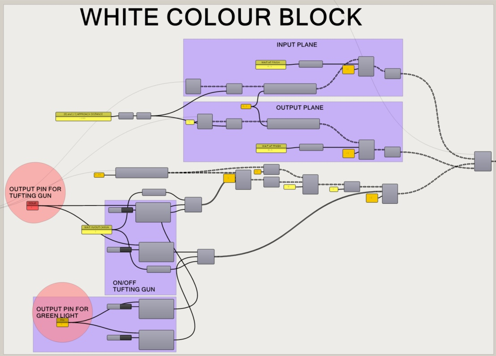

When the first block is completed, the robot deactivates the green DO, activates the red DO, and moves to a preset rest position to proceed with the thread color change.
Once the thread has been changed, a pushbutton, configured via a DI, must be used to make the robot resume movement.

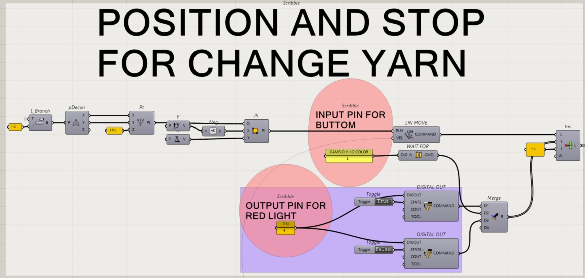

The robot begins weaving the brown lines. Digital output (DO) pins are used to activate and deactivate the tufting gun, as well as to light up a green indicator showing that the robot is in operation. Once finished, the robot returns to its starting position.

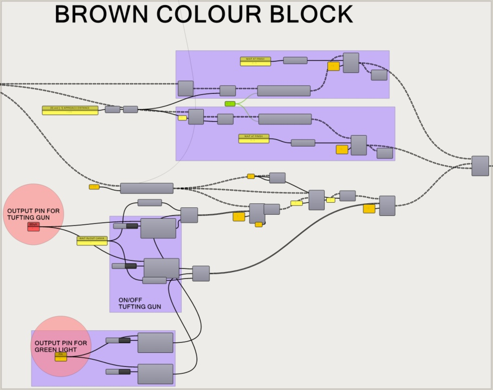

All planes and commands to be executed by the robot are connected to the KUKA|prc CORE component. The geometry of the gun is also connected to it, allowing us to simulate the toolpath and verify whether the canvas position is correct, check for collisions, singularities, etc., and make any necessary corrections.

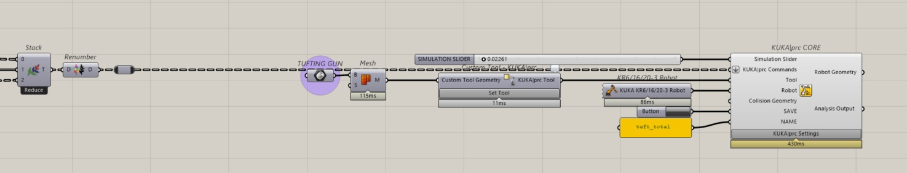

