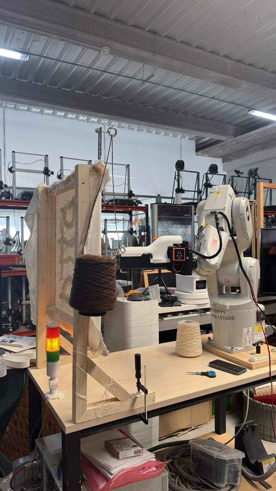
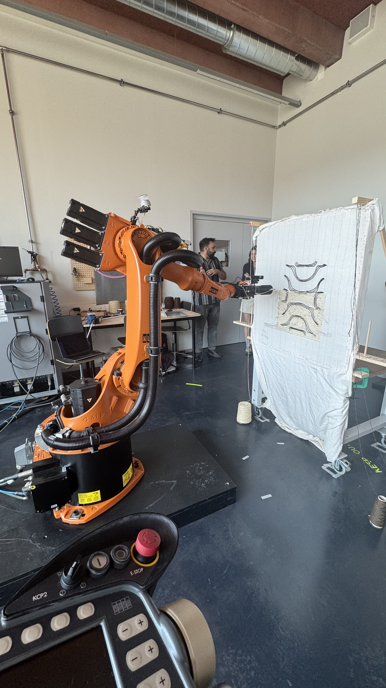
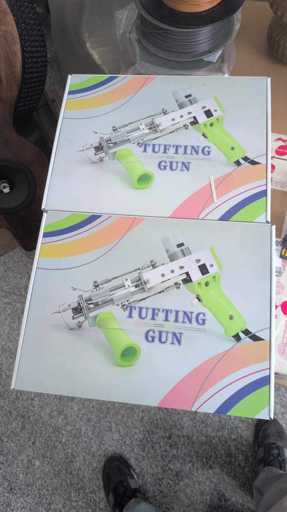

### The two set up

Set up at Lowpoly in Madrid

Set up at SUPSI Fablab in Mendrisio

Both prototypes are based on the same image (JPEG format, to ensure the script works correctly).

 

The image undergoes vectorization using the Vectorize plugin, distinguishing between two zones: the one corresponding to the color white and the one corresponding to the color brown.

